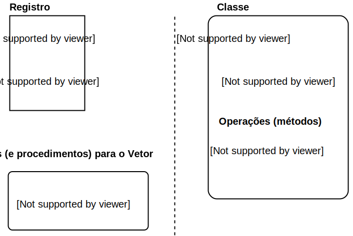

## Paradigma orientado a objetos

* [Paradigma de programação orientada a objetos (POO)](
  https://en.wikipedia.org/wiki/Object-oriented_programming);

* Objetos são "variáveis" que interagem com outros objetos por meio de métodos 
  (funções ou operações);
  
* Objetos são instâncias (variáveis) de suas respectivas classes. Uma classe
  pode ser vista como um modelo para que o objeto seja instanciado 
  (inicializado). Classe é análoga a definir um **registro (estrutura)** com 
  suas respectivas funções incorporadas. Dentro da classe já são definidas as 
  funções e procedimentos (métodos), diferente de um registro em que as 
  funções são definidas fora do registro.
  
    * `remover(vetor, elemento)`. Registro (estrutura) `vetor`, função 
      `remover()` → `vetor.remover(elemento)`. Objeto `vetor`, método (ou 
      operação) `.remover()`.
    
    * Sinônimos de objeto: **instância** e também podemos extrapolar e 
      chamar de **variável**;

* Os próprios objetos tem suas "funções" (métodos):

    * Ao invés de chamar `area(retangulo)`, chama-se `retangulo.area()`;
    
    * `soma(lista, print_=True)` → `lista.soma(True)`. Prezar pela clareza;
    
    * `semaforo2.abrir()`.



* Dada a classe Vetor, podemos instanciá-la com `vetor = Vetor(valores, 
tamanho)`;

* Podemos acessar os atributos com `vetor.valores[i]` e seu tamanho como 
`vetor.tamanho`;

* As operações (métodos) são `vetor.inserir(elemento)`, `vetor.remover(elemento)`,
  `vetor.ordenar()`;

* Métodos tem `()` ao final, diferente de atributo que não tem.

O que usar, paradigma estrutural com funções e procedimentos com registros? Ou 
paradigma orientado a objetos? Ou ambos?

Via de regra o que ficar mais claro e simples de se entender, e que claro, 
resolva o problema computacional.

Durante o curso usaremos os dois para deixar os códigos mais claros, mais 
fáceis de entender (legibilidade).


## Revisão

### Algumas formas de `print` *

```Python tab=
print('Print com mais do que um argumento', arg1, arg2)

print('dez', 10, sep='')

print('Uso do operador "percentage" para string: %s %s' % (string1, string2))

# Python Version >= 3.7
string = 'uma string'
print(f'Uma string com interpotalacao: {string}')

print(
    'Evitar linhas de codigos muito extensas pois dificulta a leitura do seu '
    'codigo, entao essa eh uma forma de vc quebrar a linha. Existe uma regra '
    'de no maximo 79-80 colunas de codigo, tente usar ela, soh que nao tem '
    'problema se passar de 80 ou chegar ateh umas 85 colunas. Essa formatacao '
    'de codigo desse print pode ser usada nos codigos tambem.')

print(
    'para quebrar a linha '
    'use dessa forma')

funcao(
    argumento1, argumento2, argumento3, argumento4, argumento5, argumento6,
    argumento7, argumento8)
```

### Variáveis simples *

```Python tab=
a = 1  # Inteiro
b = 2
c = True  # Booleano
d = 'uma string'  # String
e = 1.1  # Ponto flutuante (Float)

print(a)
1
print(b)
2
print(c)
True
print(d)
uma string
print(e)
1.1
```

### Operadores *

```Python tab=
# Aritmeticos principais: + - * / %
# Extra: ** (potencia)
a = 2
b = 4

a + b
6
a**3
8


# Logicos principais: not and or
# Comparacao: < > <= >= == !=
a = 2
b = 4

a > b
False
b > a
True

b == a
False
a != b
True

True and False
False

True or False
True

not True
False

not False
True
```

### Estrutura de dado **lista**

Podemos chamar até de vetor, *array*, arranjo, sequência, pois uma lista tem
uma **ordem definida** de elementos e os elementos de uma lista também **podem 
ser repetidos**.

```Python tab=
lista_de_numeros = [-1, 0, 1, 2, 3, 4, 5, 6, 7]
lista_de_letras = ['a', 'b', 'c', 'x', 'y', 'z']
lista_mista = [0, 1, 'a', 'b', 'c', 'string', 1.1]
people_list = ['allan', 'maria', 'jose', 'enzo', 'valentina']

lista_mista[3]
'b'

people_list[3]
enzo

len(people_list)
5

people_list.append('allan')

people_list.count('allan')

people_list.insert(1, 'lucas')

people_list.remove('allan')

lista_de_numeros + lista_de_letras

[-1, 0, 1, 2, 3, 4, 5, 6, 'a', 'b', 'c', 'x', 'y', 'z']

people_list.pop()
'lucas'
```

### Operador IN

Operador que retorna uma avaliação booleana (True or False). Análogo à 
notação de conjutos "pertence" (diferente de "está contido").

 ```Python
 VARIAVEL in ESTRUTURA_QUE_SUPORTA_IN
 ```


```Python tab=
10 in [1, 2, 3, 4]
 
11 in [1, 2, 11, 4]

'enzo' in ['allan', 'maria', 'jose', 'enzo', 'valentina']
 
 
[1, 2, 3, 4] in [1, 2, 3, 4]
 
lista_de_inteiros = [1, 2, 3, 4] 
lista_mista = [[1, 2, 3, 4], 'a', 'b', 'c']
 
lista_de_inteiros in lista_mista
```
 

### Estruturas de repetição **

**FOR, WHILE,**

#### FOR ***

Análogo à notação de formação de conjuntos.

Exemplos:

* Para cada x pertencente ao conjunto {1, 2, 3, 4} crie um conjunto com o
  quadrado de x;

* Para cada x pertencente ao conjunto {1, 2, 3, 4} imprima o dobro de x;

* Para cada x pertencente ao conjunto {1, 2, 3, 4} imprima o dobro de x se x
 for par.
 
 Então podemos dizer que da para ler um ** *for* ** da seguinte forma: "para
 cada elemento na lista faça:"

```Python tab=
for ELEMENTO in ITERADOR:
    CORPO DO FOR
```

```C tab=
for (i=0; i<n; i++) {
    CORPO DO FOR
}
```

Um **iterador** é uma abstração para que iterações sejam feitas de forma 
mais simples, sema necessidade de usar índices em *fors* por exemplo.
Se o iterador for vazio, o corpo (escopo) do `for` 
não é executado. Caso contrário o corpo do `for` é executado em todos 
elementos do iterador.

```Python tab=
# Iterador de uma lista.
for i in [1, 2, 3, 4, 5, 6, 7, 8, 9, 10]:
    print('i: %s', i)
1
2
3
4
5
6
7
8
9
10

# Iterador de um conjunto.
for i in {1, 2, 3, 4, 5, 6, 7, 8, 9, 10}:
    print('i: %s', i)
```

Outros exemplos com FOR:

```Python tab=
range(10)  # Funcao pronta (interna) do Python.
range(0, 10)

# Transformar o "range" em uma "list" (vetor).
# Para fins de aprendizado, vetor e lista (list) sao sinonimos.
list(range(10))
[0, 2, 3, 4, 5, 6, 7, 8, 9]

list(range(5, 10))
[5, 6, 7, 8, 9]

list(range(5, 10, 2))
[5, 7, 9]

vetor = [1, 2, 3, 4, 5, 6, 7, 8, 9, 10]

tamanho = len(vetor)  # Funcao pronta (interna) do Python.
print(tamanho)
10
for i in range(tamanho):
    print('i: %s' % vetor[i])


# Alernativa mais elegante.
for elemento in vetor:
    print('Elemento: %s', elemento)
    
# Alernativa elegante enumerada.
for i, elemento in enumerate(vetor):
    print('Elemento %s: %s' % (i, elemento))
    
list(enumerate(vetor))
[(0, 1), (1, 2), (2, 3), (3, 4), (4, 5), (5, 6), (6, 7), (7, 8), (8, 9)]

nomes = ['joao', 'maria,' 'jose']
for i, elemento in enumerate(nomes):
    print('Elemento %s: %s', (i, elemento))
```

#### Exercício

Crie uma função que receba 5 nomes e coloque esses nomes em uma lista1 que 
está na ordem dos argumentos, e em uma lista2 que está na ordem inversa dos 
argumentos. (sem usar *reverse*)

#### WHILE *

```Python tab=
while CONDICAO:
    CORPO DO WHILE
```

Enquanto a `condição` for `verdadeira` o while é executado 
indefinidamente; caso contrário o `while` para sua execução.  

```Python tab=
condicao = True
i = 0
while condicao:
    print(i)
    i += 1
    if i > 10:
        condicao = False
```

### Função **

```Python tab=
def nome(parametro1, parametro2):
    CORPO DA FUNCAO
    return VALOR
```

## Exercício: encontrar posição de um elemento em um vetor **

Dado um `vetor` e um `elemento` como entrada para uma função chamda de `find`,
retorne a posição do elemento encontrado; caso não seja encontrado retorne
`None` (nulo).

```Python tab=
def find(vetor, elemento):
```

## Exemplos e revisão

### Vetor (Arranjo)

#### Formato:

```Python tab=
# Em python o nome dessa estrutura de dado eh conhecida como lista
# Mas para fins de exemplo criamos uma variavel com o nome vetor.
# Indices do vetor comeca em 0.
vetor = [1, 2, 3, 4, 5, 6, 7, 8, 9, 10]
print(vetor[0])
1
```

```C tab=
/* Aqui alocamos um vetor de inteiros com 10 elementos, sendo eles todo 
*  o intervalo [1, 10].
*  Indicies comecam em 0.
*/ 
int vetor[] = {1, 2, 3, 4, 5, 6, 7, 8, 9, 10};
printf("%d", vetor[0]);
1
```

#### Gerenciamento:

Em um vetor podemos: **adicionar, atualizar, excluir e ler** elementos.

##### Adicionar *

Adição modifica o vetor original, aumentando pelo menos um elemento novo.

```Python tab=
vetor = [1, 2, 3, 4, 5, 6, 7, 8, 9, 10]
vetor.append(11)  # Metodo (funcao) de orientacao a objeto.
vetor
[1, 2, 3, 4, 5, 6, 7, 8, 9, 10, 11]

# Apenas para mostrar como eh no "paradigma estrutural".
def meu_append(vetor, novo_elemento):
    vetor.append(novo_elemento)
    # Funcao nao retorna nada, podemos chamar de "procedimento".

vetor = [1, 2, 3, 4, 5, 6, 7, 8, 9, 10]
meu_append(vetor, novo_elemento)
vetor
[1, 2, 3, 4, 5, 6, 7, 8, 9, 10, 11] 

```

##### Atualizar *

Atualização precisa modificar algum elemento já existente do vetor original.

```Python tab=
vetor = [1, 2, 3, 4, 5, 6, 7, 8, 9, 10]
vetor[2] = 11
vetor
[1, 2, 11, 4, 5, 6, 7, 8, 9, 10]
```

##### Remover *

```Python tab=
vetor = [1, 2, 3, 4, 5, 6, 7, 8, 9, 10]
vetor.remove(5)  # Qual algoritmo eh necessario ANTES de remover?
vetor
[1, 2, 3, 4, 6, 7, 8, 9, 10]
# TODO: exercicio: fazer o seu proprio remover.
def meu_remover(vetor, elemento):
    pass
    # Funcao nao retorna nada
```

##### Ler *

```Python tab=
# Leitura NAO pode modificar o nosso vetor original
vetor = [1, 2, 3, 4, 5, 6, 7, 8, 9, 10]
a = vetor[2]
a
2
# Leitura direta do vetor para impressao
print(vetor[2])
```

#### Armazenamento: **

Memória RAM, registradores do processador (CPU), dispositivo de 
armazenamento secundário (HDDs, SSDs, etc).

##### Memória RAM **

Um vetor de caracteres armazenados em memória RAM.

```
# Assumindo que cada caracter tem um byte.

vetor = ['1', '2', '3', '4', '5', '6', '7', '8', '9', '10']

Endereço  Dado

100000    '1'
100001    '2'
100002    '3'
100003    '4'
100004    '5'
100005    '6'
100006    '7'
100007    '8'
100008    '9'
100009    '10'
```

## Pesquisa sequencial

Dado um elemento, e uma lista, encontre o elemento dentro da lista sem usar 
o operado `in`.

## Pesquisa binária

* Requisito: lista ordenada;